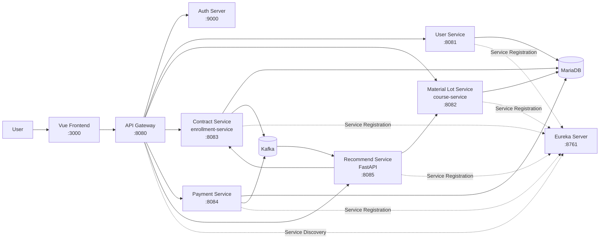

# Industrial By-product Circular Marketplace

> **산업 부산물을 필요한 기업의 원료로 연결하는 B2B 순환거래 플랫폼**

기업에서 발생하는 폐배터리, 폐플라스틱, 금속 부산물 등의 산업 부산물을  
다른 기업이 다시 원료로 활용할 수 있도록 **등록 → 검토 → 거래 → 추천** 과정을 지원하는 서비스입니다.

서비스를 도메인별 마이크로서비스로 분리하고, **Spring Boot, FastAPI, Eureka, Kafka, API Gateway, Docker Compose**를 활용해 MSA 환경으로 구성했습니다.

---

## 1. 프로젝트 소개

제조 과정에서 발생하는 산업 부산물은 재사용 가치가 있음에도 적절한 수요 기업을 찾기 어려워 폐기되는 경우가 있습니다.

반대로 원료를 필요로 하는 기업은 자신에게 적합한 부산물을 직접 탐색하고 비교해야 합니다.

이 프로젝트는 이러한 문제를 해결하기 위해

- **공급기업**이 산업 부산물을 판매 로트로 등록하고
- **중간기업**이 등록된 원료를 검토하며
- **구매기업**이 승인된 원료를 조회하고 거래하고
- 기존 구매 이력을 바탕으로 적합한 원료를 추천받을 수 있는

**B2B 순환경제 거래 플랫폼**을 구현했습니다.

---

## 2. 핵심 사용자

### 공급기업 Supplier

산업 부산물을 보유하고 판매하려는 기업입니다.

- 산업 부산물 로트 등록
- 등록한 로트 조회 및 수정
- 판매 로트 철회
- 검토 결과 확인

### 중간기업 Intermediary

등록된 산업 부산물을 검토하는 기업입니다.

- 등록된 원료 정보 검토
- 판매 승인
- 판매 거절 및 사유 작성
- 원료 설명 보정

### 구매기업 Buyer

산업 부산물을 원료로 구매하려는 기업입니다.

- 승인된 판매 로트 조회
- 원료 구매 및 계약
- 구매 이력 조회
- 구매 이력 기반 원료 추천

---

## 3. 주요 기능

### 3.1 산업 부산물 로트 등록

공급기업은 판매하려는 부산물을 하나의 **Material Lot**으로 등록합니다.

등록 정보에는 다음과 같은 데이터가 포함됩니다.

- 원료명
- 원료 설명
- 카테고리
- 가격
- 수량
- 공급 지역
- 주요 성분 및 함량
- 공급기업 정보

지원하는 원료 카테고리는 다음과 같습니다.

```text
METAL
PLASTIC
BATTERY
ELECTRONIC
CHEMICAL
CONSTRUCTION
TEXTILE
OTHER
```

---

### 3.2 판매 로트 검토

공급기업이 등록한 로트는 바로 판매되지 않고 먼저 `PENDING` 상태가 됩니다.

중간기업의 검토 결과에 따라 다음과 같이 상태가 변경됩니다.

```text
신규 등록
   │
   ▼
PENDING
   │
   ├──── 승인 ────▶ APPROVED ──── 계약 완료 ────▶ SOLD
   │                    │
   │                    └──── 판매 철회 ────────▶ WITHDRAWN
   │
   ├──── 거절 ────▶ REJECTED
   │                    │
   │                    └──── 수정 ─────────────▶ PENDING
   │
   └──── 판매 철회 ─────────────────────────────▶ WITHDRAWN
```

잘못된 상태 전이는 도메인 로직에서 차단합니다.

예를 들어,

- `PENDING` 상태가 아닌 로트 승인
- 이미 판매된 로트 철회
- 승인되지 않은 로트 구매

등의 요청은 허용하지 않습니다.

---

## 4. 구매 및 계약

구매기업은 중간기업의 검토를 통과한 `APPROVED` 상태의 로트만 구매할 수 있습니다.

MVP에서는 하나의 판매 로트를 하나의 구매기업이 전체 구매하는 방식으로 구현했습니다.

```text
APPROVED
    │
    ▼
구매 요청
    │
    ▼
계약 / 결제
    │
    ▼
SOLD
```

현재 MVP에서는 다음 기능은 범위에서 제외했습니다.

- 부분 구매
- 로트 수량 분할
- 복수 구매자 재고 선점
- 실결제 PG 연동

---

## 5. 원료 추천

구매기업이 매번 전체 판매 목록을 탐색하지 않아도 되도록 별도의 `recommend-service`를 구성했습니다.

현재 추천 기능은 **규칙 기반 Recommendation**으로 구현되어 있습니다.

### 기존 구매 이력이 있는 경우

```text
구매 이력 조회
     │
     ▼
가장 많이 구매한 카테고리 분석
     │
     ▼
해당 카테고리에서 자주 구매한 성분 분석
     │
     ▼
동일 카테고리의 APPROVED 로트 조회
     │
     ▼
성분 일치 개수 기준 Ranking
     │
     ▼
상위 5개 로트 추천
```

예를 들어 구매기업이 기존에

```text
PLASTIC / PP
PLASTIC / PP + PE
PLASTIC / PE
BATTERY / LITHIUM
```

와 같은 구매 이력을 가지고 있다면,

가장 많이 구매한 `PLASTIC` 카테고리를 기준으로 후보를 찾고  
`PP`, `PE` 등의 주요 성분이 많이 일치하는 로트를 우선 추천합니다.

### 신규 구매기업

구매 이력이 없는 사용자는 개인화 기준이 없기 때문에

**전체 승인 로트 중 거래가 많은 인기 로트**를 우선 추천합니다.

---

## 6. System Architecture



---

## 7. Microservice 구성

| Service | 역할 | Port |
|---|---|---:|
| `api-gateway` | 외부 요청 진입점 및 서비스 라우팅 | 8080 |
| `auth-server` | 인증 및 JWT 발급 | 9000 |
| `eureka-server` | 서비스 등록 및 탐색 | 8761 |
| `user-service` | 기업 사용자 및 기업 유형 관리 | 8081 |
| `course-service` | 산업 부산물 로트 등록·조회·검토·상태 관리 | 8082 |
| `enrollment-service` | 구매 계약 및 구매 이력 관리 | 8083 |
| `payment-service` | 거래 결제 처리 | 8084 |
| `recommend-service` | 구매 이력·성분 기반 원료 추천 | 8085 |
| `vue-frontend` | 사용자 Web UI | 3000 |

---

## 8. MSA 설계

### Service Discovery

각 마이크로서비스는 Eureka Server에 자신의 위치를 등록합니다.

이를 통해 서비스의 IP나 Port를 직접 관리하는 대신  
서비스 이름을 기준으로 서비스를 탐색할 수 있도록 구성했습니다.

```text
Service
   │
   │ Register
   ▼
Eureka Server

API Gateway / Other Service
   │
   │ Discover
   ▼
Target Service
```

---

### API Gateway

클라이언트가 각각의 마이크로서비스에 직접 접근하는 대신  
API Gateway를 서비스의 단일 진입점으로 사용합니다.

```text
Client
   │
   ▼
API Gateway
   │
   ├── User Service
   ├── Course Service
   ├── Enrollment Service
   ├── Payment Service
   └── Recommend Service
```

이를 통해 라우팅과 인증 경계를 서비스 앞단에서 관리합니다.

---

### Authentication

Auth Server에서 발급된 JWT를 기반으로 인증을 처리합니다.

각 서비스는 Resource Server로 동작하며 JWT의 JWK 정보를 이용해 요청을 검증합니다.

```text
Client
   │
   ▼
Auth Server
   │
   │ JWT
   ▼
Client
   │
   ▼
API Gateway
   │
   ▼
Microservice
```

---

### Kafka

서비스 간 모든 작업을 동기 REST 호출로 연결하지 않고  
비동기 처리가 필요한 영역에는 Kafka를 사용했습니다.

이를 통해 특정 서비스가 다른 서비스의 내부 구현에 강하게 결합되지 않도록 구성했습니다.

Kafka는 별도의 ZooKeeper 없이 **KRaft 방식**으로 실행됩니다.

---

### Python Recommendation Service 분리

일반적인 비즈니스 로직은 Spring Boot 기반 서비스로 구성했지만  
추천 기능은 별도의 FastAPI 서비스로 분리했습니다.

```text
Spring Boot Services
        │
        ├── REST
        │
        ▼
FastAPI Recommend Service
        │
        ├── 구매 이력 조회
        ├── 카테고리 분석
        ├── 성분 분석
        └── 추천 Ranking
```

추천 로직을 독립 서비스로 분리해 이후 추천 알고리즘이나 AI 모델을 적용하더라도  
기존 거래 서비스에 미치는 영향을 최소화할 수 있도록 구성했습니다.

---

## 9. Technology Stack

### Backend

```text
Java
Spring Boot
Spring Data JPA
Spring Security
Spring WebClient
Spring Cloud Netflix Eureka
```

### Recommendation

```text
Python
FastAPI
Pydantic
```

### Infrastructure

```text
Docker
Docker Compose
MariaDB
Apache Kafka
Eureka
API Gateway
OAuth2 / JWT
```

### Frontend

```text
Vue.js
Vite
```

---

## 10. 프로젝트 구조

```text
MSA_practice
│
├── user-service
│   └── 기업 사용자 관리
│
├── course-service
│   └── 산업 부산물 판매 로트 관리
│
├── enrollment-service
│   └── 구매 계약 / 구매 이력 관리
│
├── payment-service
│   └── 거래 결제 처리
│
├── recommend-service
│   └── 원료 추천
│
├── eureka-server
│   └── Service Discovery
│
├── vue-frontend
│   └── Web Frontend
│
├── init-db
│   └── 초기 DB 데이터
│
├── docker-compose.yml
│
└── readme.md
```

---

## 11. 실행 방법

### 1. Repository Clone

```bash
git clone https://github.com/HanSangJun01/MSA_practice.git
cd MSA_practice
```

### 2. Infrastructure Image 준비

Auth Server와 API Gateway 이미지 파일이 제공된 환경에서는 다음과 같이 이미지를 로드합니다.

```bash
docker load -i infra-images.tar
```

이미지 확인:

```bash
docker images
```

예:

```text
msa-lecture/auth-server:1.0
msa-lecture/api-gateway:1.0
```

---

### 3. Backend 전체 실행

```bash
docker compose build --no-cache
docker compose up -d
```

한 번에 실행하려면:

```bash
docker compose build --no-cache && docker compose up -d
```

---

### 4. 실행 상태 확인

```bash
docker compose ps
```

전체 로그:

```bash
docker compose logs -f
```

개별 서비스 로그:

```bash
docker compose logs -f eureka-server
docker compose logs -f auth-server
docker compose logs -f api-gateway
docker compose logs -f user-service
docker compose logs -f course-service
docker compose logs -f enrollment-service
docker compose logs -f payment-service
docker compose logs -f recommend-service
```

---

### 5. Frontend 실행

```bash
cd vue-frontend
npm install
npm run dev
```

브라우저에서 접속:

```text
http://localhost:3000
```

---

## 12. 서비스 실행 순서

Docker Compose의 `depends_on`과 Health Check를 이용해 서비스 의존성을 관리합니다.

```text
MariaDB / Kafka
        │
        ▼
Eureka Server
        │
        ▼
Auth Server
        │
        ▼
API Gateway
        │
        ├── User Service
        ├── Course Service
        ├── Enrollment Service
        └── Payment Service
                │
                ▼
        Recommend Service
```

Eureka Dashboard:

```text
http://localhost:8761
```

API Gateway:

```text
http://localhost:8080
```

---

## 13. 주요 설계 포인트

### 도메인 단위 서비스 분리

사용자, 판매 로트, 계약, 결제, 추천 기능을 각각 독립 서비스로 분리했습니다.

서비스별 역할을 명확하게 구분해 특정 기능 변경이 전체 시스템에 미치는 영향을 줄이는 것을 목표로 했습니다.

### 원료 상태 전이 관리

원료 로트의 상태를 단순 DB 값으로 변경하지 않고  
도메인 객체 내부에서 허용된 상태 전이만 수행하도록 구현했습니다.

```text
PENDING
 ├─ APPROVED
 ├─ REJECTED
 └─ WITHDRAWN

REJECTED
 └─ PENDING

APPROVED
 ├─ SOLD
 └─ WITHDRAWN
```

### 서비스 간 직접 DB JOIN 지양

다른 서비스가 관리하는 정보를 직접 Entity 관계로 연결하기보다  
필요한 식별자만 저장하고 서비스 API를 통해 데이터를 조회하는 방향으로 구현했습니다.

### 추천 서비스 독립

추천 기능을 FastAPI 기반 독립 서비스로 분리해  
거래 로직과 추천 로직의 변경 주기를 분리했습니다.

---

## 14. MVP 범위 및 현재 한계

현재 프로젝트는 MSA 구조와 B2B 순환거래 핵심 흐름을 검증하기 위한 MVP입니다.

따라서 다음과 같은 제한이 있습니다.

- 하나의 판매 로트는 하나의 구매기업이 전체 구매
- 부분 구매 및 재고 분할 미지원
- 실제 PG 기반 결제가 아닌 결제 흐름 중심 구현
- 추천은 Machine Learning이 아닌 규칙 기반
- Spring 서비스들이 동일한 MariaDB 인스턴스를 사용
- Docker Compose 기반 단일 머신 실행 환경
- 운영 환경 수준의 Observability / HA / 분산 트랜잭션은 범위 밖

향후 실제 MSA 운영 환경으로 확장한다면

```text
Database per Service
Distributed Tracing
Centralized Logging
Circuit Breaker
Retry / Timeout
Saga Pattern
Kubernetes
AI 기반 Matching / Recommendation
```

등을 추가할 수 있습니다.
